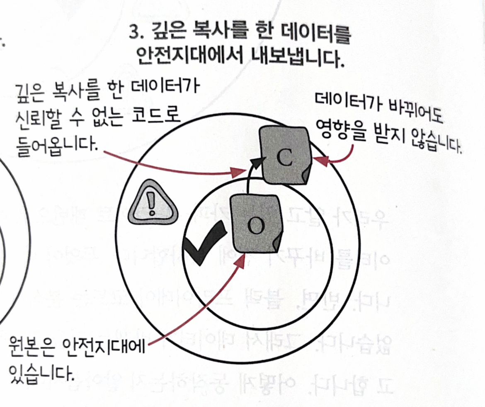
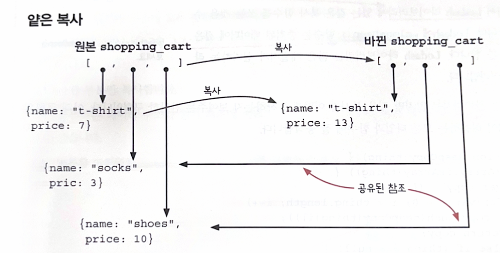
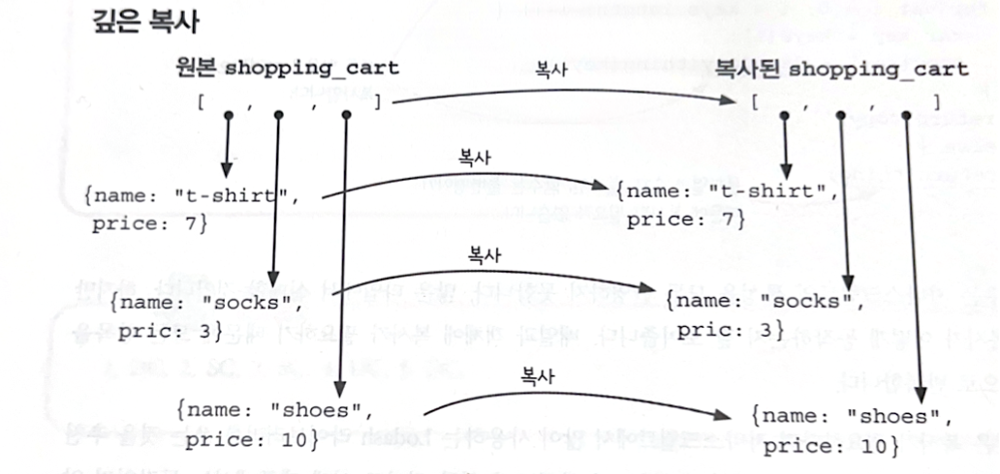

# 7장. 신뢰할 수 없는 코드를 쓰면서 불변성 지키기

# 목표

- 레거시 코드, 신뢰할 수 없는 코드로부터 “방어적 복사” 만들기
- 얕은 복사 vs 깊은 복사
- Copy-on-Write 와 방어적 복사

# 레거시 코드와 불변성

레거시 코드 = 오래전에 만든 코드로, 지금 당장 고칠 순 없어서 그대로 사용해야하는 코드

### 요구사항

장바구니에 제품을 담을 때, 블랙프라이데이용 행사가격이 적용되도록 하기

```jsx
function add_item_to_cart(name, price) {
	...
	black_friday_promotion(shopping_cart); // 이 코드를 추가하여 장바구니 값을 바꾸기
}
```

black_friday_promotion 함수와 같이, 어떤 일이 일어날지 정확히 알 수 없는 레거시 코드를 다루기 위해

**데이터가 바뀌는 것을 완벽히 막아주는 원칙이 필요**합니다.

→ 이 원칙이 바로 **“방어적 복사”**

## 방어적 복사 단계

방어적 복사 동작 방식: 들어오고 나가는 데이터의 복사본을 만드는것



1. 안전지대에 들어온 데이터를 “깊은 복사” 하여 복사본을 만든다.
2. 깊은 복사를 한 데이터를 안전지대 밖으로 내보낸다.

### 구현하기

1. 데이터를 함수의 인자로 넘기기 전에 깊은 복사하기

```jsx
function add_item_to_cart(name, price) {
	...
	var cart_copy = deepCopy(shopping_cart); // 넘기기 전에 깊은 복사
	black_friday_promotion(carty_copy);
}
```

1. 데이터를 전달한 후에 복사

```jsx
function add_item_to_cart(name, price) {
	...
	var cart_copy = deepCopy(shopping_cart);
	black_friday_promotion(carty_copy);

	shopping_cart = deepCopy(cart_copy); // 들어오는 데이터를 위한 복사
}
```

## 방어적 복사 규칙

1. 데이터가 안전한 코드에서 나갈 때 복사하기
   - 변경 불가능한 데이터가 신뢰할 수 없는 코드로 나갈 때, 아래 단계로 원본 데이터를 보호한다.
     1. 불변성 데이터를 위한 깊은 복사본을 만든다.
     2. 신뢰할 수 없는 코드로 복사본을 전달한다.
2. 안전한 코드로 데이터가 들어올 때 복사하기
   - 신뢰할 수 없는 코드에서 변경될 수도 있는 데이터가 들어온다면 다음 단계를 따른다.
     1. 변경될 수 있는 데이터가 들어오면 바로 깊은 복사본을 만들어 안전한 코드로 전달한다.
     2. 복사본을 안전한 코드에서 사용한다.

이 규칙으로, 불변성 원칙을 지키면서 신뢰할 수 없는 코드와 상호작용 할 수 있다.

두 규칙의 순서는 상관없다.

### 신뢰할 수 없는 코드 감싸기

방어적 복사 코드를 분리해, 새로운 함수로 만들어두자.

- 이유: black_friday_promotion() 함수가 다른곳에서 또 필요할 수도 있고, 나중에 코드를 보면 복사본을 왜 만드는지 이유를 모를 수가 있기 때문.

**분리한 버전**

```jsx
function add_item_to_cart(name, price) {
	...

	shopping_cart = black_friday_promotion_safe(shopping_cart);
}

function black_friday_promotion_safe(cart) {
	var cart_copy = deepCopy(cart);
	black_friday_promotion(cart_copy);
	return deepCopy(cart_copy);
}
```

이제 `black_friday_promotion_safe` 함수를 쓰면 데이터가 바뀌지 않는다.

## 방어적 복사 또 다른 예시

웹 API 속의 방어적 복사

- 대부분의 웹 기반 API 는 암묵적으로 방어적 복사를 한다.
  JSON 데이터가 API 요청으로 들어오면, 클라이언트는 이를 직렬화한다. → “깊은 복사본”
  그리고 JSON 으로 응답을 준다. → “깊은 복사본”
- Micro-service 에서, 방어적 복사로 서로 다른 코드와 원칙을 가진 서비스들이 문제없이 통신할 수 있다.

얼랭, 엘릭서에서의 방어적 복사

- 두 함수형 프로그래밍 언어에서 방어적 복사를 잘 구현했다.
- 얼랭에서 두 프로세스가 서로 메세지를 주고 받을때,
  수신자의 메일박스에서 data 가 복사되고, 프로세스에서 데이터가 나갈 때도 data 를 복사한다.

---

# Copy-on-Write vs 방어적 복사

### Copy-on-Write

- 통제할 수 있는 데이터를 바꿀 때 사용
- 안전지대 어디서나 사용 가능
- **얕은 복사**
- 규칙
  1. 바꿀 데이터의 얕은 복사 만들기
  2. 복사본 변경
  3. 복사본 리턴

### 방어적 복사

- 신뢰할 수 없는 코드와 데이터를 주고받을 때 사용
- 안전지대의 경계에서 데이터가 오고 갈 때 사용
- **깊은 복사**
- 규칙
  1. 안전지대로 들어오는 데이터에 깊은 복사본 만들기
  2. 안전지대에서 나가는 데이터에 깊은 복사본 만들기

---

# 얕은 복사 vs 깊은 복사

**얕은 복사**

- 바뀌지 않은 값이라면 원본과 복사본이 데이터를 공유함.



**깊은 복사**

- 원본과 어떤 데이터 구조도 공유하지 않음. 중첩된 모든 객체나 배열을 복사함.
- 비용이 비싸다.
- 모든 곳에 쓰기보다, Copy-on-Write 를 사용할 수 없는 곳에서만 사용해야한다.



## JavaScript 에서 “깊은 복사” 구현하기

JS 에서는 표준 라이브러리가 좋지 않아 깊은 복사를 구현하기 어렵다.

### 추천

Lodash 라이브러리의 `.cloneDeep()` 함수: 중첩된 데이터에 깊은 복사를 한다.

### 직접 구현하기

```jsx
function deepClone(obj) {
  if (obj === null || typeof obj !== 'object') {
    return obj;
  }

  let clonedObj;

  if (Array.isArray(obj)) {
    clonedObj = [];
    for (let i = 0; i < obj.length; i++) {
      clonedObj[i] = deepClone(obj[i]); // 재귀적으로 복사
    }
  } else {
    clonedObj = {};
    for (let key in obj) {
      if (obj.hasOwnProperty(key)) {
        clonedObj[key] = deepClone(obj[key]); // 재귀적으로 복사
      }
    }
  }

  return clonedObj;
}

// 예제 사용
const original = { a: 1, b: { c: 2, d: [3, 4] } };
const copied = deepClone(original);

console.log(copied); // { a: 1, b: { c: 2, d: [3, 4] } }
```

---

# 정리

- 방어적 복사는,
  - 불변성을 구현하는 원칙이다. 데이터가 들어오고 나갈 때 복사본을 만든다.
  - 깊은 복사를 하므로, Copy-on-Write 보다 비용이 비싸다.
  - Copy-on-Write 와 다르게, 불변성 원칙을 구현하지 않은 코드로부터 데이터를 보호해준다.
- 복사본이 많이 필요하지 않은 Copy-on-Write 를 더 많이 사용하고, 방어적 보사는 신뢰할 수 없는 코드와 함께 사용할 때만 사용한다.

### 다음 장에서…

지금까지 배운 내용을 모두 합쳐서 “시스템 설계를 개선하기 위해” 코드를 어떻게 구성해야하는지 알아보자.
